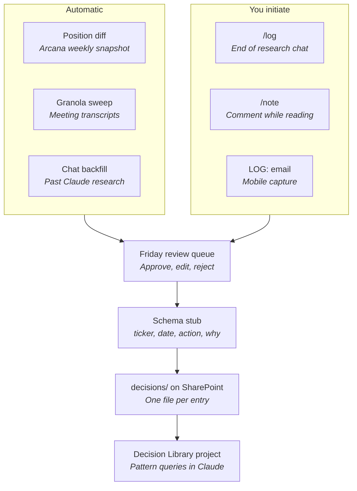

# Claude knowledge base architecture

Design notes for a firm knowledge base in Claude that supports pattern recognition
across investment decisions, and a capture pipeline that survives contact with a
real workload.

---

## 1. The four layers

Claude has four places to put firm knowledge. Most implementations dump everything
into one and quality degrades.

| Layer | Holds | Where |
|---|---|---|
| Project knowledge | Reference docs, philosophy, taxonomies — stable text you want in context | Claude Project |
| Project instructions | Standing behavioral rules, house style, what Claude should always challenge | Project settings |
| Skills | Repeatable *procedures* — memo format, diligence checklist, screen workflow | `SKILL.md` in a plugin |
| MCP | Live data — Arcana positions, Bigdata news, FMP fundamentals | Connectors |

**Rule of thumb: the knowledge base holds judgment, MCP holds facts.**

Never paste position data or prices into project knowledge. It goes stale and
poisons answers. Project knowledge switches to RAG mode as it approaches context
limits (expanding capacity up to 10x), but a focused knowledge base outperforms a
large one regardless of the ceiling.

## 2. Source of truth lives outside Claude

Canonical files live in a git repo (`C:\Users\ej4\Documents\GitHub\DUMACKnowledge`)
as markdown, synced to SharePoint. Project knowledge is a **mirror**, not the
original.

Reasons:

- Version history and diff review
- One file feeds Projects + Skills + Cowork tasks
- Survives any product change

## 3. Documents to write

### 3.1 `philosophy.md`

The constitution. Not marketing language. Specifics:

- What edge you believe you have and why it persists
- Time horizon and what that rules out
- What you structurally will not own — and the reasoning, not just the list
- Position sizing, concentration, correlation to the rest of the endowment
- Where the Direct Team's judgment applies vs. deference to external managers

### 3.2 `underwriting-framework.md`

The questions every name must answer before it becomes a position. Ordered.
Disqualifiers explicit.

### 3.3 `decision-journal/`

**This is the one that produces pattern recognition.** Everything else is
documentation; this is data. One file per decision.

Passes matter more than buys — that's where firm philosophy actually lives, and
it's the dataset nobody keeps.

### 3.4 `post-mortems/`

Same schema plus `what_we_got_wrong` and `was_it_process_or_outcome`. The only
source that lets Claude say "this rhymes with the 2024 thesis that broke."

### 3.5 `themes.md`

Live theme taxonomy (AI infra, power, semis) with sub-drivers under each. Makes
Claude route new names to existing thinking instead of treating each in isolation.

### 3.6 `glossary.md`

Internal shorthand, portfolio names, who's who. Cheap, high leverage.

### 3.7 `house-style.md`

Memo structure, what a DUMAC write-up looks like. Feed to a Skill, not just
project knowledge.

## 4. Project structure

Don't build one mega-project. Context is not shared across chats within a project
unless it's in the knowledge base, and mixed domains degrade retrieval quality.

- **Direct Team – Philosophy & Process** — philosophy, framework, style, glossary.
  All process questions.
- **Direct Team – Decision Library** — journal + post-mortems only. This is the
  pattern-recognition project.
- **Per-theme projects** for active work (AI Infrastructure, Power) — theme docs
  plus live MCP.

---

## 5. The capture problem

Manual authoring fails because it asks you to re-say something you already said.
The reasoning already exists — in Granola transcripts, Claude research chats,
Outlook threads, and Arcana position changes.

**Principle: harvest exhaust, don't author entries.**

### 5.1 Tier the schema hard

Most decisions get four fields. Full write-ups are the exception.

**Tier 1 — stub (90% of entries, auto-generated, you add one line):**

```yaml
ticker: WULF
date: 2026-03-14
action: pass
why: "power contracts shorter than the AI-infra multiple implies"
```

**Tier 2 — full entry:** only for initiations, exits, and passes on names that
took more than two hours.

Everything else — price, market cap, sector, multiples at decision date, existing
position, theme tag — Claude backfills from FMP / Bigdata / Arcana at write time.
**Never type a number you can look up.**

### 5.2 The annotation path

Reading a report or a news item, having a reaction, and losing it is the largest
silent leak. `/note` captures it with no decision required:

```yaml
ticker: WOLF
date: 2026-09-07
action: observation
source: "SemiAnalysis — SiC capacity buildout"
why: "capacity adds don't square with the pricing they're modeling"
theme: power-semis
```

Same folder, same fields, so it surfaces later under *"what did we already think
about this?"* Observations are the connective tissue that turns a decision library
into pattern recognition rather than a trade log.

---

## 6. Capture pipeline



Two properties worth holding onto:

1. **Everything converges before it stores.** Six sources, one schema, one folder.
   If `/note` writes somewhere different from `/log`, you get two half-libraries
   and neither answers a question.
2. **The queue is the only manual step.** Capture is free, storage is automatic,
   consumption is Claude. Total ongoing cost is Friday.

<details>
<summary>Rendered SVG version of the diagram</summary>

<svg width="100%" viewBox="0 0 680 700" xmlns="http://www.w3.org/2000/svg" role="img">
<title>Decision capture pipeline</title>
<defs><marker id="arrow" viewBox="0 0 10 10" refX="8" refY="5" markerWidth="6" markerHeight="6" orient="auto-start-reverse"><path d="M2 1L8 5L2 9" fill="none" stroke="#73726c" stroke-width="1.5" stroke-linecap="round" stroke-linejoin="round"/></marker></defs>
<rect x="40" y="40" width="290" height="232" rx="20" fill="#E1F5EE" stroke="#0F6E56" stroke-width="0.5"/>
<text x="185" y="64" text-anchor="middle" dominant-baseline="central" font-family="sans-serif" font-size="14" font-weight="500" fill="#085041">Automatic</text>
<rect x="60" y="88" width="250" height="52" rx="8" fill="#ffffff" stroke="#B4B2A9" stroke-width="0.5"/>
<text x="185" y="106" text-anchor="middle" dominant-baseline="central" font-family="sans-serif" font-size="14" font-weight="500" fill="#2C2C2A">Position diff</text>
<text x="185" y="124" text-anchor="middle" dominant-baseline="central" font-family="sans-serif" font-size="12" fill="#5F5E5A">Arcana weekly snapshot</text>
<rect x="60" y="150" width="250" height="52" rx="8" fill="#ffffff" stroke="#B4B2A9" stroke-width="0.5"/>
<text x="185" y="168" text-anchor="middle" dominant-baseline="central" font-family="sans-serif" font-size="14" font-weight="500" fill="#2C2C2A">Granola sweep</text>
<text x="185" y="186" text-anchor="middle" dominant-baseline="central" font-family="sans-serif" font-size="12" fill="#5F5E5A">Meeting transcripts</text>
<rect x="60" y="212" width="250" height="52" rx="8" fill="#ffffff" stroke="#B4B2A9" stroke-width="0.5"/>
<text x="185" y="230" text-anchor="middle" dominant-baseline="central" font-family="sans-serif" font-size="14" font-weight="500" fill="#2C2C2A">Chat backfill</text>
<text x="185" y="248" text-anchor="middle" dominant-baseline="central" font-family="sans-serif" font-size="12" fill="#5F5E5A">Past Claude research</text>
<rect x="350" y="40" width="290" height="232" rx="20" fill="#EEEDFE" stroke="#534AB7" stroke-width="0.5"/>
<text x="495" y="64" text-anchor="middle" dominant-baseline="central" font-family="sans-serif" font-size="14" font-weight="500" fill="#3C3489">You initiate</text>
<rect x="370" y="88" width="250" height="52" rx="8" fill="#ffffff" stroke="#B4B2A9" stroke-width="0.5"/>
<text x="495" y="106" text-anchor="middle" dominant-baseline="central" font-family="sans-serif" font-size="14" font-weight="500" fill="#2C2C2A">/log</text>
<text x="495" y="124" text-anchor="middle" dominant-baseline="central" font-family="sans-serif" font-size="12" fill="#5F5E5A">End of research chat</text>
<rect x="370" y="150" width="250" height="52" rx="8" fill="#ffffff" stroke="#B4B2A9" stroke-width="0.5"/>
<text x="495" y="168" text-anchor="middle" dominant-baseline="central" font-family="sans-serif" font-size="14" font-weight="500" fill="#2C2C2A">/note</text>
<text x="495" y="186" text-anchor="middle" dominant-baseline="central" font-family="sans-serif" font-size="12" fill="#5F5E5A">Comment while reading</text>
<rect x="370" y="212" width="250" height="52" rx="8" fill="#ffffff" stroke="#B4B2A9" stroke-width="0.5"/>
<text x="495" y="230" text-anchor="middle" dominant-baseline="central" font-family="sans-serif" font-size="14" font-weight="500" fill="#2C2C2A">LOG: email</text>
<text x="495" y="248" text-anchor="middle" dominant-baseline="central" font-family="sans-serif" font-size="12" fill="#5F5E5A">Mobile capture</text>
<line x1="185" y1="276" x2="292" y2="304" stroke="#73726c" stroke-width="1.5" marker-end="url(#arrow)"/>
<line x1="495" y1="276" x2="388" y2="304" stroke="#73726c" stroke-width="1.5" marker-end="url(#arrow)"/>
<rect x="190" y="310" width="300" height="56" rx="8" fill="#FAEEDA" stroke="#BA7517" stroke-width="0.5"/>
<text x="340" y="330" text-anchor="middle" dominant-baseline="central" font-family="sans-serif" font-size="14" font-weight="500" fill="#633806">Friday review queue</text>
<text x="340" y="350" text-anchor="middle" dominant-baseline="central" font-family="sans-serif" font-size="12" fill="#854F0B">Approve, edit, reject</text>
<line x1="340" y1="366" x2="340" y2="392" stroke="#73726c" stroke-width="1.5" marker-end="url(#arrow)"/>
<rect x="190" y="400" width="300" height="56" rx="8" fill="#ffffff" stroke="#B4B2A9" stroke-width="0.5"/>
<text x="340" y="420" text-anchor="middle" dominant-baseline="central" font-family="sans-serif" font-size="14" font-weight="500" fill="#2C2C2A">Schema stub</text>
<text x="340" y="440" text-anchor="middle" dominant-baseline="central" font-family="sans-serif" font-size="12" fill="#5F5E5A">ticker, date, action, why</text>
<line x1="340" y1="456" x2="340" y2="482" stroke="#73726c" stroke-width="1.5" marker-end="url(#arrow)"/>
<rect x="190" y="490" width="300" height="56" rx="8" fill="#ffffff" stroke="#B4B2A9" stroke-width="0.5"/>
<text x="340" y="510" text-anchor="middle" dominant-baseline="central" font-family="sans-serif" font-size="14" font-weight="500" fill="#2C2C2A">decisions/ on SharePoint</text>
<text x="340" y="530" text-anchor="middle" dominant-baseline="central" font-family="sans-serif" font-size="12" fill="#5F5E5A">One file per entry</text>
<line x1="340" y1="546" x2="340" y2="572" stroke="#73726c" stroke-width="1.5" marker-end="url(#arrow)"/>
<rect x="140" y="580" width="400" height="56" rx="8" fill="#FAECE7" stroke="#D85A30" stroke-width="0.5"/>
<text x="340" y="600" text-anchor="middle" dominant-baseline="central" font-family="sans-serif" font-size="14" font-weight="500" fill="#712B13">Decision Library project</text>
<text x="340" y="620" text-anchor="middle" dominant-baseline="central" font-family="sans-serif" font-size="12" fill="#993C1D">Pattern queries in Claude</text>
<text x="340" y="664" text-anchor="middle" font-family="sans-serif" font-size="12" fill="#5F5E5A">Teal: runs without you. Purple: one command. Amber: your 15 minutes.</text>
</svg>

</details>

---

## 7. The six capture mechanisms

### 7.1 Position-diff trigger — highest yield, fully automatic

Weekly Cowork task: pull `get_portfolio_positions` for Direct - Global Ideas
(portfolio ID 9030956), diff against last week's snapshot stored in SharePoint.
Any new ticker, exit, or NAV% change beyond a threshold (±25bps) generates a
pre-filled stub with everything except `why`.

One email Friday with N stubs. Reply with N sentences. Trades are ground truth and
mechanically detectable — never write those by hand.

### 7.2 End-of-chat logging skill — highest quality

`dumac-decision-log`, triggered by `/log` at the end of any research conversation.
The reasoning is already in the transcript. The skill reads the conversation,
drafts the entry in schema, shows it, you confirm or edit one field, it writes to
SharePoint.

Cost to you: two words. Build this first — it captures thinking at peak fidelity.

### 7.3 Reading annotation — `/note`

See §5.2. Triggered while reading a report, sellside note, or news item. Writes an
`action: observation` entry. No decision required, no queue delay if you'd rather
it write immediately.

### 7.4 Granola sweep — this is how you catch passes

Passes have no system footprint, which is why nobody logs them. But they get said
out loud in meetings.

Weekly Cowork task: `list_meetings` for the prior week, pull transcripts, extract
every named company discussed and its disposition. Output a draft queue. Granola is
transcribing already — marginal cost is zero.

### 7.5 Outlook capture line

Forward anything to yourself with subject prefix `LOG:` plus one sentence. Weekly
Cowork task sweeps `subject:LOG:` via `outlook_email_search`, converts to stubs,
moves to a Logged folder.

Works from a phone, works mid-thread, no app switch. No Power Automate required.

### 7.6 Claude conversation backfill

One-time run: `conversation_search` across existing research chats for names
already evaluated, propose stubs retroactively. Solves the cold-start problem that
kills these projects — a decision library with five entries finds no patterns.

---

## 8. The ritual

Friday, 15 minutes. One email with the week's draft queue from all sources.

You are **reviewing and approving**, not writing. Approval is a fundamentally
different cognitive task from composition, and it's the reason this survives past
month two.

If a week gets skipped, the queue accumulates rather than evaporating.

---

## 9. Guardrails

**One file per entry, not one big file.** `decisions/2026-03-14-WULF-pass.md`.
Large shared files hit merge conflicts and become read-only in practice.

**Freeze the schema now.** Adding a field in November means the first 60 entries
can't be queried on it, which quietly destroys the pattern-recognition value.

Freeze list:

- `ticker`
- `date`
- `action` — `initiate | add | trim | exit | pass | observation`
- `why`
- `theme`

Plus `outcome_check_date` on `initiate | exit | pass`, and `source` on
`observation`. Everything else goes in the free-text body, where it costs nothing
and constrains nothing.

---

## 10. Build order

1. `philosophy.md` + `glossary.md` — one afternoon, unblocks everything
2. `dumac-decision-log` skill (`/log`) and `dumac-note` (`/note`) — start capturing
3. Conversation backfill — seeds 20–30 entries immediately
4. Position-diff weekly Cowork task — makes all trades self-logging
5. `underwriting-framework.md` + `themes.md`
6. Granola sweep and `LOG:` email sweep
7. Screen and memo skills (`dumac-new-name-screen`, `dumac-memo`)

Steps 1–4 produce a queryable library in about a week of elapsed time, with
roughly two hours of direct input.

**Failure mode to avoid:** elaborate structure with a thin decision library. Volume
of *reasoned decisions with consistent fields* is what makes Claude useful for
pattern recognition. Everything else is scaffolding.
